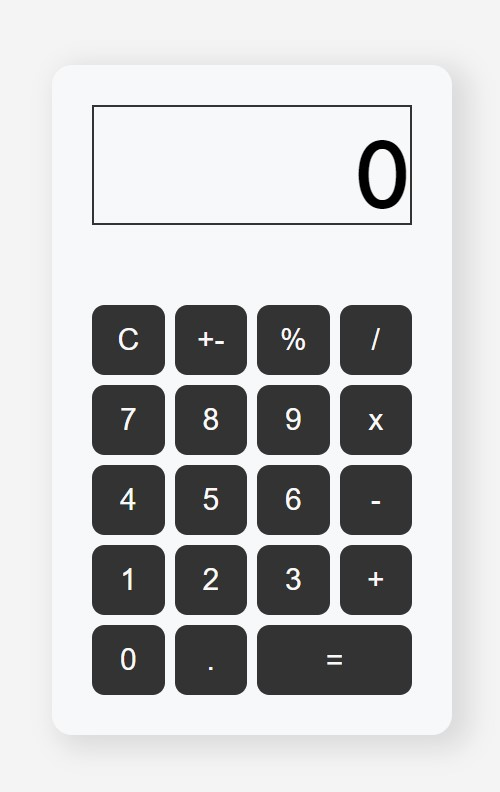

# Calculator

### A basic calculator application created with React

## How to Run the Project

To get a local copy up and running follow these steps:  

### Install the libraries

	npm install 
### Start the server
	
	npm start
